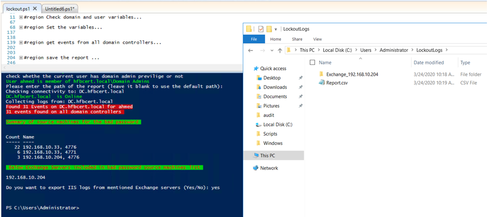

# Get-BadPasswordSourceMachines
A PowerShell script to get the source machines of bad password from domain controllers and compare these source machines IP addresses with Exchange servers IP addresses. 

If any Exchange servers included in the source machine list, It will collect IIS logs from them after your confirmation. 

# Usage
.\Get-LockoutEvents.ps1 <username> <DomainName>.
 
UserName: sAMAccountName of the user account.
DomainName: NetBIOS or FQDN of any domain in the forest.
 
If you do not provide any parameters, the script will ask you to supply values for both parameters. If any value provided is not valid, it will throw an exception and notify which parameter is not correct.
 
The output will be saved as Report.csv in the same location you run the script. You may also provide an alternate path before running the event collection.

Example:

